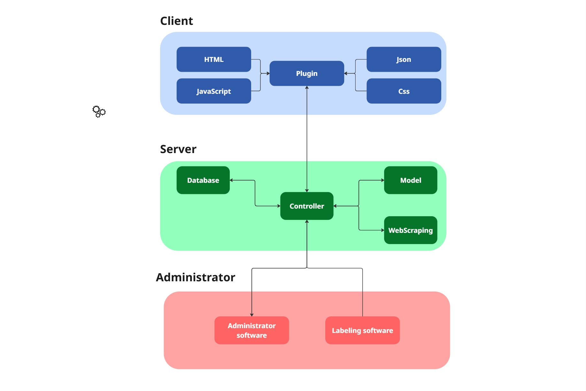

# Twitter Censor Plugin

## Table of Contents
1. [Introduction](#introduction)
2. [Features](#features)
3. [Architecture](#architecture)
4. [Project Structure](#project-structure)
5. [Installation](#installation)
6. [Usage](#usage)
7. [Team Members](#team-members)
8. [Acknowledgments](#acknowledgments)

## Introduction

Twitter Censor Plugin is a full-stack project designed to detect and filter toxic content on Twitter. It combines a powerful machine learning backend with a browser extension frontend to provide real-time detection and hiding of toxic tweets. The system is trained on labeled tweet datasets and includes tools for data scraping and manual annotation. Whether you're researching online hate speech or building tools for healthier digital environments, this project offers a complete pipeline from data collection to user interface.

## Features

- Toxic tweet classifier trained with labeled data.
- Scraper to collect tweets using the Twitter API or direct scraping.
- Visual tool to manually label tweets.
- Backend API server to serve the model.
- Browser extension that detects and hides toxic content in real-time.
- Support for multiple browsers (Chrome and Opera).

## Architecture


## Project Structure

The project is organized into the following directories:

1. `backend`: Contains the API server, machine learning model, and database logic.
2. `frontend-extension`: Contains the browser extension (JavaScript/TypeScript) for detecting and hiding toxic content.
3. `data`: Contains datasets used for training and labeling.
   - `raw`: Raw, unprocessed tweet data.
   - `labeled`: Tweets labeled as toxic or non-toxic.
4. `scraper`: Contains scripts for scraping Twitter data via API or other means.
5. `label-tool`: Contains the interface for manually labeling tweet data.
6. `docs`: Contains technical documentation, project design notes and other relevant files.
7. `tests`: Contains unit and integration tests for backend and model components.
8. `README.md`: Main documentation file for the project.
9. `requirements.txt`: Lists the dependencies of the project.

## Installation

1. Create a virtual environment:
```bash
python3 -m venv venv
```

2. Activate the virtual environment:
```bash
source venv/bin/activate  # On Unix/macOS
# or
.\venv\Scripts\activate  # On Windows
```

3. Install dependencies:
```bash
pip install -r requirements.txt
```

## Usage

The script can be run with either Chrome or Opera browser:

1. Using Chrome (default):
```bash
python WebScrapper.py
```

2. Using Opera:
```bash
python WebScrapper.py --browser opera
```

After running the script:
1. A browser window will open
2. Log in to Twitter manually
3. The script will start injecting classification and blur buttons into tweets
4. Use the buttons to classify tweets and apply/remove blur effects

## Team Members

- [Matías Aguirre Erazo](https://github.com/matiasAguirreE)
- [Franco Navarro](https://github.com/frank3421)
- [Ignacio Alveal](https://github.com/overexpOG)
- [Joaquín González Latin]()
- [Vicente Facundo Onetto](https://github.com/Vonetto)

## Acknowledgments

We would like to thank the Universidad de Chile and our professors for their guidance and support throughout this project. We also appreciate the open-source community.
